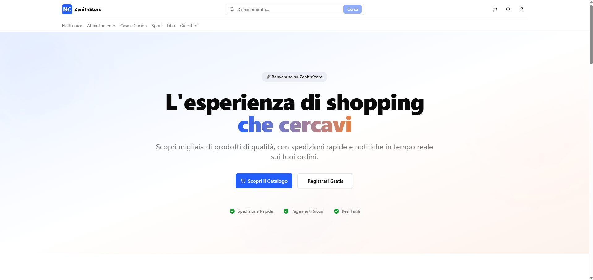
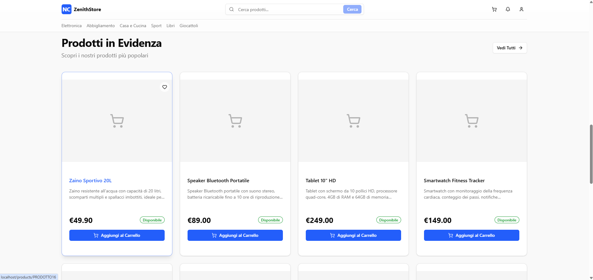
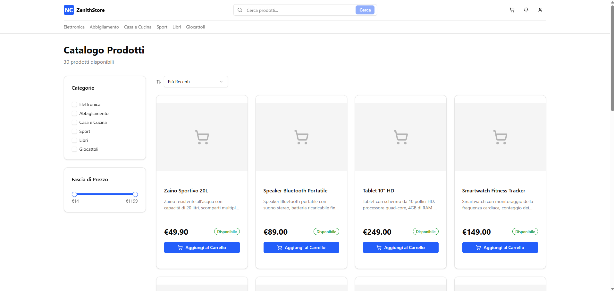
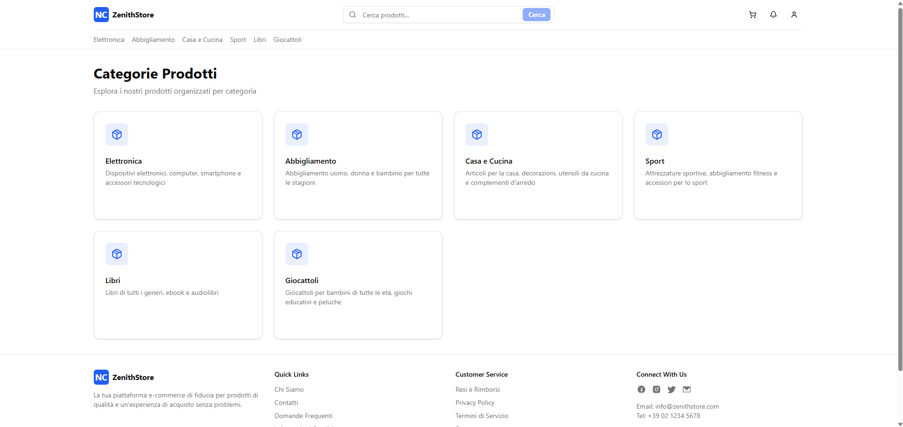
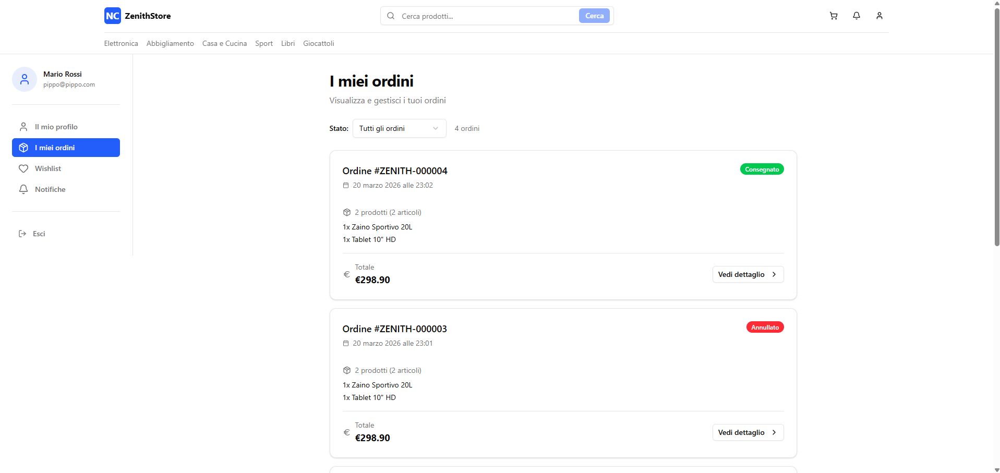
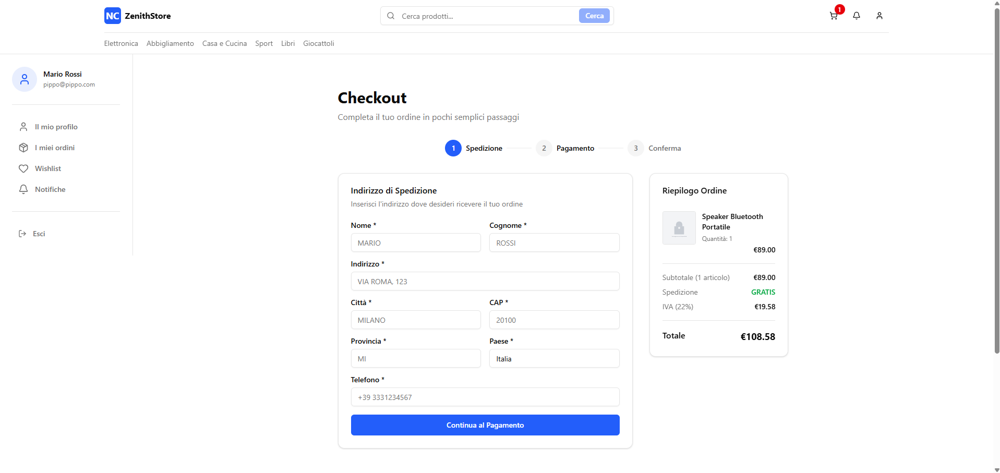
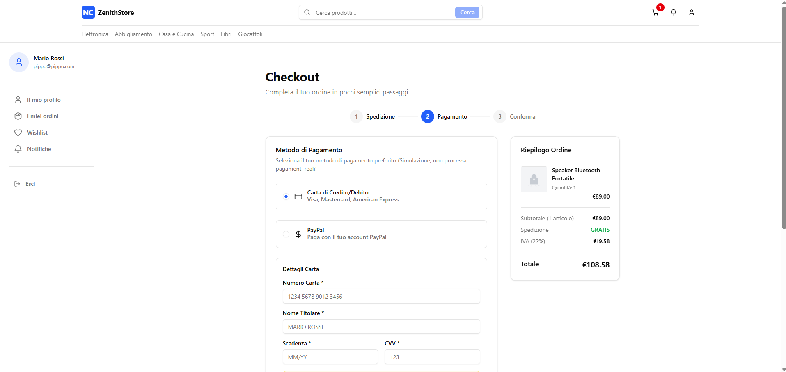

# ZenithStore Online APP

Progetto conclusivo del corso "DevOps e Gestione del ciclo di vita del software" (Repo APP).















## 📌 Specifiche del Progetto

### 🚀 Deploy Automatizzato di un E-commerce Senza Downtime

ZenithStore Online è un e-commerce in forte espansione che vende prodotti di alta gamma a livello internazionale. Con l'aumento esponenziale del traffico e delle transazioni, diventa fondamentale garantire che ogni aggiornamento della piattaforma avvenga senza interrompere il servizio, mantenendo sempre la disponibilità del sito.

L'azienda ha deciso di adottare una soluzione DevOps per automatizzare il processo di deploy delle nuove versioni dell'applicativo. Il sistema dovrà consentire rilasci continui, implementare rollback immediati in caso di errore e integrare strumenti di monitoraggio per verificare la stabilità e le prestazioni post-deploy.

### 🚀 Valore aggiunto del progetto

Questo progetto ti consentirà di mettere in pratica tecniche fondamentali per la gestione professionale dell'infrastruttura IT moderna: automazione dei rilasci, zero downtime deployments, gestione rapida delle anomalie e monitoraggio continuo delle applicazioni. Queste competenze sono essenziali per lavorare in qualsiasi ambiente che richieda alta disponibilità e affidabilità.

### ✅ Requisiti di alto livello

- ⚙️ **Pipeline di CI/CD**: progettare e implementare una pipeline di integrazione continua che automatizzi i processi di build, test e deploy.
- 📊 **Monitoraggio delle prestazioni**: integrare strumenti di monitoraggio (es. Prometheus, Grafana, o alternative) per tracciare metriche chiave come tempi di risposta, uptime, e error rate.
- 🔧 **Gestione configurazioni**: mantenere separati i file di configurazione ambientale per facilitare i deploy su ambienti diversi (sviluppo, staging, produzione).
- 📖 **Documentazione operativa**: redigere una breve guida operativa che descriva la pipeline, i comandi principali e le procedure di emergenza.

## 🏗️ Struttura Progetto (Monorepo)

Il progetto è organizzato come **monorepo** con backend e frontend separati:

```
profession-ai-web-development-sistema-notifiche-ecommerce/
├── backend/                    # Backend Express + TypeScript
│   ├── src/                    # Codice sorgente backend
│   ├── .env                    # Environment variables backend
│   ├── package.json
│   └── tsconfig.json
├── frontend/                   # Frontend Next.js
│   ├── app/                    # Next.js App Router
│   ├── components/             # Componenti React riutilizzabili
│   ├── hooks/                  # Custom React Hooks
│   ├── lib/                    # Utility e configurazioni
│   ├── public/                 # Asset statici (manifest, service worker, icons)
│   ├── stores/                 # Zustand stores per state management
│   ├── types/                  # TypeScript type definitions
│   ├── proxy.ts                # Proxy configuration per WebSocket
│   ├── .env                    # Environment variables frontend
│   ├── package.json
│   └── tsconfig.json
├── documentations/             # Documentazione e script DB
│   ├── ddl.sql                 # Schema database MySQL
│   ├── dml.sql                 # Dati di esempio
│   ├── mongo-init.js           # Inizializzazione MongoDB
│   ├── SETUP.md                # Guida setup completa
│   └── ORDER_LIFECYCLE.md      # Documentazione lifecycle ordini
├── docker-compose.yml          # Orchestrazione MySQL + MongoDB
├── .prettierrc                 # Configurazione Prettier
├── .gitignore                  # Git ignore patterns
└── README.md                   # Questo file
```

## 🚀 Quick Start

### 📋 Prerequisites
- **Node.js** 18.x+ 
- **Docker Desktop** (for MySQL and MongoDB databases)
- **Git**

### ⚡ Installation

```bash
# 1. Clone the repository
git clone <repository-url>
cd profession-ai-web-development-sistema-notifiche-ecommerce

# 2. Start databases with Docker Compose
# This automatically creates MySQL and MongoDB containers
docker-compose up -d

# Wait for MySQL to be fully initialized (check with)
docker-compose logs -f mysql
# Press Ctrl+C to exit logs when you see "ready for connections"

# Wait for MongoDB to be fully initialized (check with)
docker-compose logs -f mongodb
# Press Ctrl+C to exit logs when you see "Waiting for connections"

# 3. Setup Backend
cd backend
npm install

# 4. Configure backend environment variables
# Edit backend/.env file if needed (default values work with Docker)

# 5. Start backend development server
npm run dev

# 6. Setup Frontend (in a new terminal)
cd frontend
npm install

# 7. Configure frontend environment variables
# Edit frontend/.env file if needed (default values work with Docker)
# IMPORTANT: JWT_SECRET must match the backend .env value

# 8. Start frontend development server
npm run dev
```

> **Note**: Docker Compose automatically creates databases (MySQL on port 3306, MongoDB on port 27018) and runs DDL/DML scripts.
> The JWT_SECRET must be identical in both backend/.env and frontend/.env for proper authentication.
> For detailed setup instructions, see [SETUP.md](./documentations/SETUP.md).

### 🌐 Backend API

Once the backend is running:
- **Base URL**: `http://localhost:3000`
- **WebSocket URL**: `ws://localhost:3000`
- **Health Check**: `http://localhost:3000/health`
- **API Documentation**: `http://localhost:3000/api/docs`
- **User Interface Page**: `http://localhost:3000/user-interface`

#### Core API Endpoints
- **Users**: `/api/users` - Technical user management (admin functions)
- **Customers**: `/api/customers` - Customer management and authentication
- **Categories**: `/api/categories` - Product category management
- **Products**: `/api/products` - Product catalog and inventory management
- **Reviews**: `/api/products/:code/reviews` - Product reviews with moderation (MongoDB)
- **Questions**: `/api/products/:code/questions` - Product Q&A system (MongoDB)
- **Wishlist**: `/api/wishlist` - Customer wishlist management
- **Orders**: `/api/orders` - Order creation, tracking and management
- **Payments**: `/api/payments` - Payment processing integration
- **Shipments**: `/api/shipments` - Shipment tracking and management
- **Notifications**: `/api/notifications` - Real-time notification system with WebSocket support (MongoDB)

### 🖥️ Frontend Application

Once the frontend is running:
- **Base URL**: `http://localhost:3001`
- **Features**: Product catalog, shopping cart, checkout process, real-time notifications via WebSocket
- **Authentication**: NextAuth.js integration with backend JWT tokens

### 🏗️ Production Build

To build and run the application in production mode:

```bash
# Build Backend
cd backend
npm run build
npm start

# Build Frontend (in a new terminal)
cd frontend
npm run build
npm start
```

## 📚 Documentation

- **[Setup Guide](./documentations/SETUP.md)** - Detailed installation and configuration instructions
- **[Order Lifecycle](./documentations/ORDER_LIFECYCLE.md)** - Complete order lifecycle documentation with payment and shipping integrations
- **[API Documentation](http://localhost:3000/api/docs)** - Interactive OpenAPI documentation (available when server is running)

### ⚠️ Nota sulla Documentazione

La documentazione tecnica (`ORDER_LIFECYCLE.md`) e la specifica OpenAPI (`api-documentation.json`) sono state generate con l'ausilio di strumenti di intelligenza artificiale. Sebbene siano state verificate e corrette, potrebbero contenere imprecisioni o errori. Si consiglia di fare riferimento al codice sorgente come fonte definitiva in caso di dubbi o discrepanze.

## 📌 ZenithStore Online - Credits & Informazioni sul progetto

### 👨‍💻 Sviluppo Frontend e Backend

L'implementazione completa del progetto è stata sviluppata da **Alberto Gelmi**, nell'ambito di un progetto realizzato per un **master in Web Development** erogato da [Profession AI](https://profession.ai/).

Il progetto include:
- **Backend**: API REST con Express.js e TypeScript, WebSocket con Socket.io per notifiche real-time
- **Frontend**: Applicazione Next.js con React 19, NextAuth.js per l'autenticazione, Zustand per lo state management
- **Database**: Script SQL (DDL/DML) per MySQL e script di inizializzazione per MongoDB
- **Interfacce**: Pagine HTML/CSS per testing e dimostrazione delle funzionalità

Il codice è stato scritto manualmente e riflette le competenze acquisite durante il percorso formativo.

## 📄 License

This project is licensed under the **MIT License** - see the [LICENSE](LICENSE) file for details.

### What this means:
- ✅ **Commercial use** - You can use this code in commercial projects
- ✅ **Modification** - You can modify and adapt the code
- ✅ **Distribution** - You can distribute the code
- ✅ **Private use** - You can use it privately
- ⚠️ **Attribution required** - You must include the copyright notice

---

© 2026 – Questo progetto è a scopo dimostrativo e didattico.
